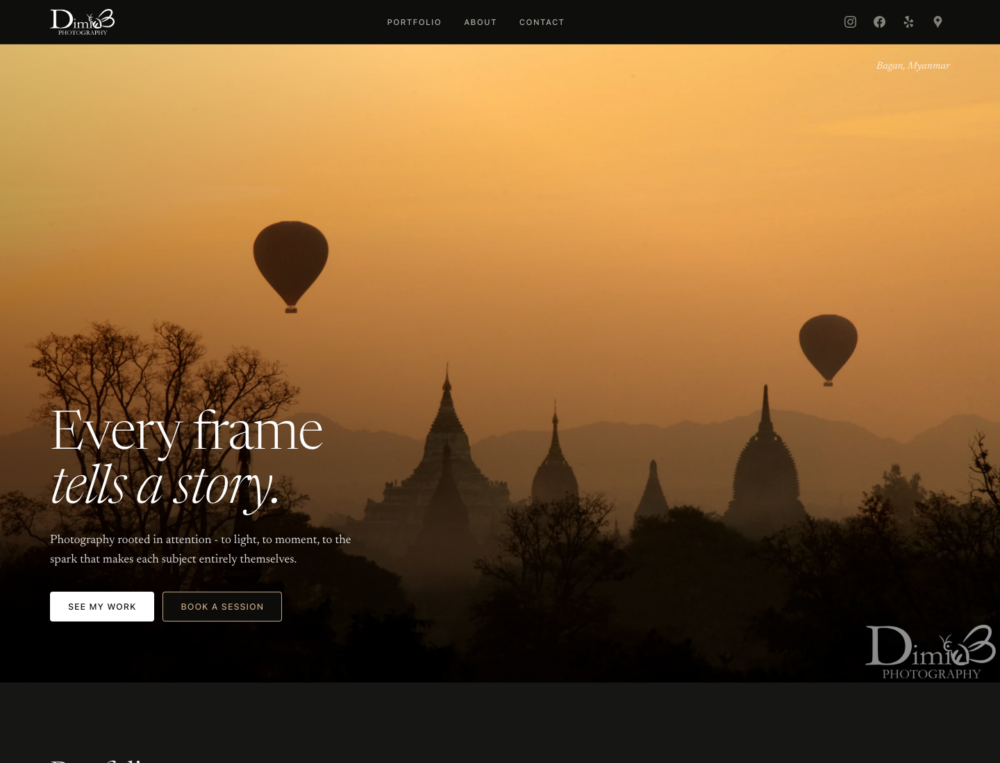

[](https://www.dimibphoto.com/)
[](https://www.dimibphoto.com/)
# Dimi B Photography

A polished portfolio and booking website for Dimi B Photography, a Northern Virginia photography brand focused on portraits, events, family sessions, and travel work.

**Live site:** [dimibphoto.com](https://www.dimibphoto.com/)



## What It Does

The site gives prospective clients a refined way to explore the photographer's work and get in touch:

- Hero section with brand positioning and booking calls to action.
- Tabbed portfolio galleries for engagement, family, portrait, and travel photography.
- Lightbox viewer for larger image previews.
- Responsive navigation with mobile menu support.
- Contact form that submits to Formspree in the background and confirms inline.
- Social links for Instagram, Facebook, Yelp, and Google.

## Tech Stack

- HTML5
- CSS3 with custom design tokens and responsive layout
- Vanilla JavaScript for tabs, lightbox, scroll states, mobile navigation, and form submission
- Formspree for contact form delivery
- Cloudinary-hosted image assets
- Google Fonts
- Vercel for deployment

## Run Locally

Open `index.html` directly in a browser, or serve the folder with any static file server.

```bash
npx serve .
```

## Project Status

This is a production-style static portfolio site. Future improvements could include a CMS-backed gallery.
